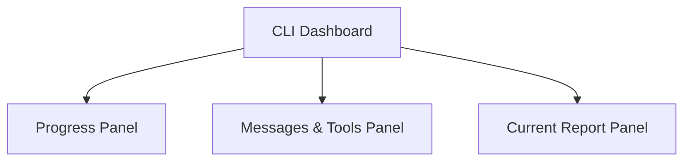
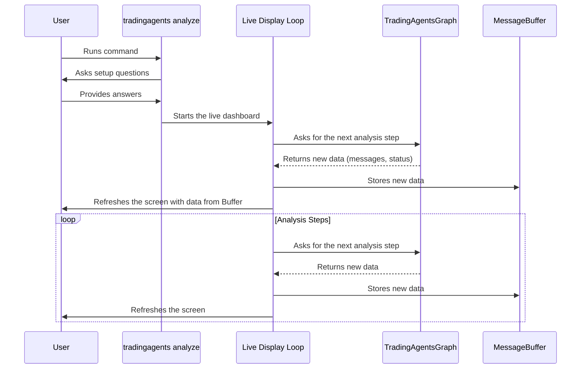

# Chapter 1: The CLI Dashboard

Welcome to the world of `TradingAgents`! This is your first step into a powerful framework where teams of AI agents collaborate to perform financial analysis. But how do you command these agents and, more importantly, how do you see what they're doing?

That's where our journey begins: with the **CLI Dashboard**.

## What is the CLI Dashboard?

Imagine you're the director of an elite team of financial analysts. You give them a task—"Analyze Apple stock (AAPL)"—and you want to watch them work. You want to see who is doing what, listen to their discussions, see the tools they use, and read their findings as they are written.

The CLI Dashboard is your window into this entire process. It's not just a boring command prompt; it's a dynamic, real-time "mission control" for your agent team, built right into your terminal.

When you start an analysis, the dashboard comes to life, giving you a transparent, "over-the-shoulder" look at:
*   **Agent Status:** Which agent is currently working, and which ones are waiting or finished.
*   **Live Feed:** A stream of thoughts, messages, and tool usage from the agents.
*   **Evolving Report:** The final analysis report, built piece-by-piece in real-time.

## Running Your First Analysis

Getting started is as simple as running a single command in your terminal. This command kicks off the entire multi-agent analysis process.

```bash
tradingagents analyze
```

Running this command starts a two-phase process: the initial setup questionnaire and the live dashboard display.

### Phase 1: The Questionnaire

Before the agents can get to work, you need to provide the mission parameters. The CLI will guide you through a friendly, interactive questionnaire.

First, you'll be greeted with a welcome screen. Then, you'll be asked a series of questions:
1.  **What ticker symbol to analyze?** (e.g., `SPY`, `AAPL`, `TSLA`)
2.  **What is the analysis date?** (e.g., `2024-08-15`)
3.  **Which analyst agents should be on the team?** You can pick and choose your specialists.
4.  **How deep should the research be?** (Shallow, Medium, or Deep)
5.  ...and a few other configuration questions.

This process uses a library called `questionary` to create an easy-to-use menu system. For example, selecting your analyst team looks like this:

```python
# From: cli/utils.py

def select_analysts() -> List[AnalystType]:
    """Select analysts using an interactive checkbox."""
    choices = questionary.checkbox(
        "Select Your [Analysts Team]:",
        choices=[ ... ], # A list of available analysts
        instruction="\n- Press Space to select/unselect...",
        # ... validation and styling ...
    ).ask()
    return choices
```
This simple code creates a rich, interactive checklist in your terminal, making it easy to configure your analysis without editing any files.

### Phase 2: The Live Dashboard

Once you've answered the questions, your terminal screen will transform into the live dashboard. It's organized into several panels, each showing a different aspect of the ongoing analysis.



Let's break down what each panel shows.

*   **Progress Panel:** Think of this as your team roster. It lists every agent involved in the analysis and shows their current status: `pending`, `in_progress` (with a cool spinner!), or `completed`. This tells you exactly who is working at any given moment.

*   **Messages & Tools Panel:** This is the live chatter. It's a feed of messages showing the "thoughts" of the agents (their reasoning process) and a log of any special **Tools** they use, like fetching stock prices or searching the web. We'll learn more about these agents and their tools in later chapters like [Agents (The Specialists)](03_agents__the_specialists_.md) and [Toolkit & Tools](05_toolkit___tools_.md).

*   **Current Report Panel:** As each agent completes their part of the analysis, their findings are added to a report. This panel shows the *most recently updated section* of that report. You can literally watch the analysis take shape, paragraph by paragraph.

## Under the Hood: How Does It Work?

The magic behind this sophisticated interface is a Python library called `rich`. It allows us to create beautiful and complex layouts in the terminal with surprising ease.

The entire process can be visualized like this:



Let's look at the key code components that make this happen.

#### 1. The Layout

First, we define the structure of our dashboard by splitting the screen into different sections. This is like drawing a wireframe for a webpage.

```python
# From: cli/main.py

def create_layout():
    layout = Layout()
    layout.split_column(
        Layout(name="header"),
        Layout(name="main"), # Main content area
        Layout(name="footer"),
    )
    layout["main"].split_column(...) # Further split the main area
    layout["upper"].split_row(
        Layout(name="progress"), # For the agent status
        Layout(name="messages"), # For the live feed
    )
    return layout
```
This code creates nested horizontal and vertical splits to build the multi-panel layout we see on the screen.

#### 2. The Message Buffer

To keep track of everything happening during the analysis, we use a central storage object called `MessageBuffer`. It's a simple class that holds lists of messages, tool calls, and agent statuses.

```python
# From: cli/main.py

class MessageBuffer:
    def __init__(self, max_length=100):
        self.messages = deque(maxlen=max_length)
        self.tool_calls = deque(maxlen=max_length)
        self.current_report = None
        self.agent_status = { # A dictionary to track each agent
            "Market Analyst": "pending",
            "Social Analyst": "pending",
            # ... and so on for all other agents
        }
```
When the analysis engine produces a new message or an agent finishes its job, we update this buffer.

#### 3. The Live Loop

The real-time updates are handled by `rich.live.Live`. This creates a context where we can continuously update and redraw our layout.

```python
# From: cli/main.py

def run_analysis():
    # ... setup ...
    layout = create_layout()

    with Live(layout, refresh_per_second=4) as live:
        # The main analysis happens inside this `stream` loop
        for chunk in graph.graph.stream(...):
            # 1. New data (a "chunk") arrives from the analysis
            # 2. We update the message_buffer with this new data
            message_buffer.add_message(...)
            message_buffer.update_agent_status(...)

            # 3. We refresh the entire display
            update_display(layout)
```
Inside the `Live` block, we loop through the analysis stream provided by the [TradingAgentsGraph](02_tradingagentsgraph_.md). With each new piece of information, we update our `MessageBuffer` and then call `update_display()`, which tells `rich` to redraw the screen with the fresh data. This loop, running several times per second, creates the illusion of a smoothly updating, real-time dashboard.

## Conclusion

The CLI Dashboard is your primary interface for interacting with the `TradingAgents` framework. It's a powerful and transparent "mission control" that transforms the complex, black-box process of a multi-agent system into an observable and intuitive experience. It handles user input through a friendly questionnaire and provides a real-time, multi-panel view of the agents as they work.

Now that you've seen the dashboard and had a glimpse of the agents in action from the outside, it's time to go one level deeper. In the next chapter, we will explore the engine that orchestrates all these agents and makes them work together as a team.

Next up: [TradingAgentsGraph](02_tradingagentsgraph_.md)

---

Generated by [AI Codebase Knowledge Builder](https://github.com/The-Pocket/Tutorial-Codebase-Knowledge)