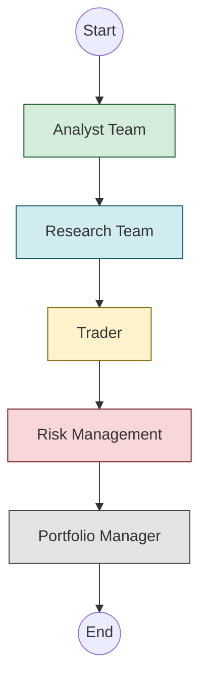
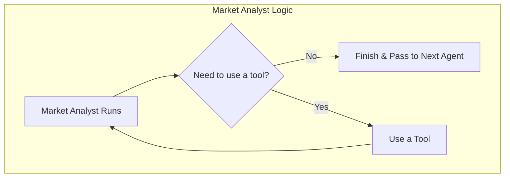
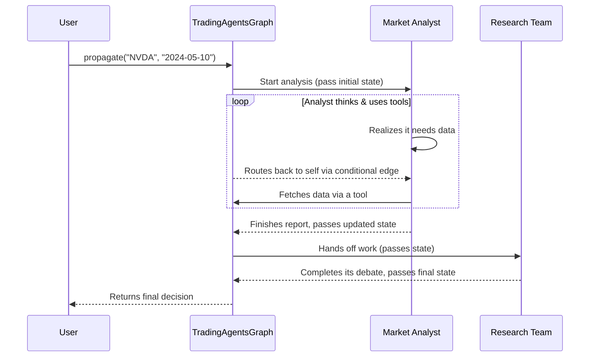

# Chapter 2: TradingAgentsGraph

In the [previous chapter](01_cli_dashboard_.md), we saw the `TradingAgents` framework in action from the outside. We watched the live dashboard as a team of AI agents analyzed a stock. But how does the system know which agent should work first? How does it decide when the Market Analyst is done and it's time for the Research Team to take over?

This is where the `TradingAgentsGraph` comes in. It's the conductor of the entire agent orchestra.

## What is a TradingAgentsGraph?

Imagine a car factory assembly line. Each station has a specific job: one adds the doors, the next installs the engine, and another paints the chassis. There's a clear, defined order to these steps.

The `TradingAgentsGraph` is the manager of our financial analysis "assembly line." It defines the exact step-by-step workflow, ensuring that a stock analysis moves from one agent to the next in the correct sequence.

*   **The Stations:** Each agent (like the Market Analyst) is a "station."
*   **The Conveyor Belt:** The connections between agents are the "conveyor belts," moving the analysis along.
*   **The Product:** The stock analysis report gets built up at each station until a final trading decision is produced at the end.

This entire structure is built using a powerful library called **LangGraph**, which is designed specifically for creating these kinds of agent workflows.

## The Workflow: From Start to Finish

The graph defines a path that looks something like this:



Let's break down how the graph is constructed with its three key ingredients: **Nodes**, **Edges**, and **Conditional Edges**.

### 1. Nodes: The Analysis Stations

A **node** is a single step in our workflow. Most of the time, a node is just one of our specialist agents. We add each agent to our graph as a distinct node or "station."

In the code, adding a node is straightforward. We give it a name (like "Market Analyst") and the agent function that does the work.

```python
# From: tradingagents/graph/setup.py

# Create an empty workflow
workflow = StateGraph(AgentState)

# Add the Market Analyst agent as a node
workflow.add_node("Market Analyst", market_analyst_node)

# Add the Research Manager agent as another node
workflow.add_node("Research Manager", research_manager_node)
```

This code tells our graph, "You have two stations available: one called 'Market Analyst' and one called 'Research Manager'." We'll learn exactly what's inside `market_analyst_node` in the next chapter, [Agents (The Specialists)](03_agents__the_specialists_.md).

### 2. Edges: The Conveyor Belts

An **edge** is a connection that tells the graph where to go next. It's the conveyor belt that moves the work from one station to the next.

For example, after the Analyst Team finishes, we want the Research Team to begin. We define this with an edge.

```python
# From: tradingagents/graph/setup.py

# The analyst work is done, so move to the researchers
last_analyst_step = "Msg Clear Fundamentals"

# Connect the last analyst step to the first researcher
workflow.add_edge(last_analyst_step, "Bull Researcher")
```

This simple line of code creates a permanent, one-way link: as soon as the step `Msg Clear Fundamentals` is finished, the work immediately goes to the `Bull Researcher`.

### 3. Conditional Edges: The Smart Router

This is where the magic happens. What if a workflow isn't a simple straight line? For example, what if our Market Analyst needs to search the web for more data before it can finish its report?

A **conditional edge** acts like a smart router. It checks the current status and decides where to go next based on some logic.



The graph asks a question: "In the last message from the agent, did it say it needs to use a tool?"
*   **If YES:** The graph routes the flow to a special `ToolNode` to fetch the data, and then sends it *back* to the Market Analyst to try again with the new information.
*   **If NO:** The agent's work is done. The graph routes the flow onward to the next agent in the assembly line.

Here’s how we define this logic in code. First, the simple function that makes the decision:

```python
# From: tradingagents/graph/conditional_logic.py

def should_continue_market(self, state: AgentState):
    """Determine if market analysis should continue."""
    last_message = state["messages"][-1]
    
    # If the agent's last message was a request to use a tool...
    if last_message.tool_calls:
        return "tools_market"  # ...go to the tool node.
    
    # Otherwise, the agent is done.
    return "Msg Clear Market"
```
This function just checks if the agent wants to use a tool. The state of the entire system is held in a special object we'll cover in the [AgentState](04_agentstate_.md) chapter.

Then, we connect this logic to the graph:

```python
# From: tradingagents/graph/setup.py

# Add the conditional edge for the Market Analyst
workflow.add_conditional_edges(
    "Market Analyst",      # The starting node
    conditional_logic.should_continue_market, # The function to call
    {
        "tools_market": "tools_market", # If it returns "tools_market", go here
        "Msg Clear Market": "Msg Clear Market" # Otherwise, go here
    }
)
```
This tells the graph: "After the `Market Analyst` runs, call the `should_continue_market` function. Then, based on its return value, go to the corresponding next node."

## Under the Hood: How the Graph Runs

So, how does this all come together when you run an analysis? When you call `ta.propagate("NVDA", "2024-05-10")`, a sequence of events is kicked off.



The `TradingAgentsGraph` class manages this entire process. It initializes all the necessary components—the agents, the tools, and the logic—and wires them together.

```python
# From: tradingagents/graph/trading_graph.py

class TradingAgentsGraph:
    def __init__(self, selected_analysts, ...):
        # ... setup LLMs, tools, etc. ...

        # Initialize our conditional logic
        self.conditional_logic = ConditionalLogic()

        # Initialize the graph setup helper
        self.graph_setup = GraphSetup(...)

        # Build the actual, runnable graph!
        self.graph = self.graph_setup.setup_graph(selected_analysts)
```

When you call the `propagate` method, it creates the initial state and starts streaming it through the compiled graph. The graph takes care of everything else, passing the state from node to node according to the edges you defined.

```python
# From: tradingagents/graph/trading_graph.py

def propagate(self, company_name, trade_date):
    # Create the initial "blank slate" for the analysis
    init_agent_state = self.propagator.create_initial_state(
        company_name, trade_date
    )
    
    # Run the state through the entire graph workflow
    final_state = self.graph.invoke(init_agent_state, ...)

    return final_state, self.process_signal(...)
```

The graph runs step-by-step, with each agent adding its contribution to the `AgentState` object, until it hits the `END` and a final decision is returned.

## Conclusion

The `TradingAgentsGraph` is the heart of the framework, acting as the director for our team of agents. It provides a clear and powerful way to define complex, multi-step workflows using a simple structure of nodes and edges. By using **LangGraph**, it can even handle cyclical logic, allowing agents to use tools or rethink their approach before passing the baton.

You now understand the "assembly line" and its manager. But who are the expert workers at each station?

Next up, we’ll meet the specialists themselves: [Agents (The Specialists)](03_agents__the_specialists_.md).

---

Generated by [AI Codebase Knowledge Builder](https://github.com/The-Pocket/Tutorial-Codebase-Knowledge)