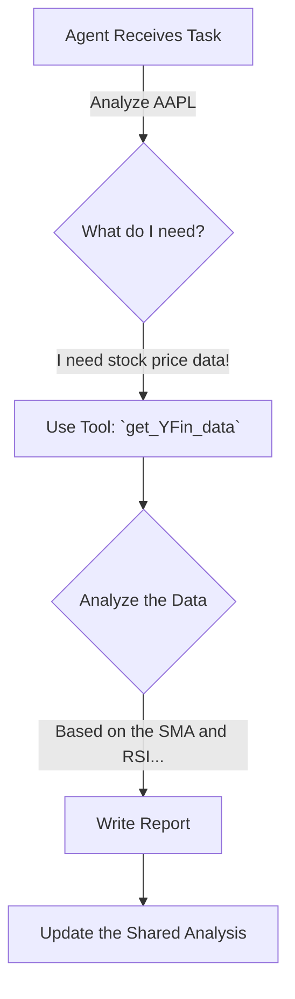

# Chapter 3: Agents (The Specialists)

In the [previous chapter](02_tradingagentsgraph_.md), we learned about the `TradingAgentsGraph`, the "assembly line manager" that directs the flow of our financial analysis. It defines the *what*, *when*, and *where* of the process.

But who are the expert workers at each station on this assembly line? Who is actually doing the analysis?

Meet the **Agents**: our team of dedicated, AI-powered specialists.

## What is an Agent?

Imagine you're building a house. You don't hire one person to do everything. You hire a team of specialists: an electrician for the wiring, a plumber for the pipes, and a carpenter for the framework. Each one has a specific job, a specific set of instructions, and their own unique set of tools.

In `TradingAgents`, our agents are just like that. Each agent is a specialized AI assistant, powered by a Large Language Model (LLM), with a very specific role on the analysis team.

*   The **`Market Analyst`** is like a seasoned chartist who lives and breathes technical indicators.
*   The **`Social Media Analyst`** is a trend-spotter, scrolling through Reddit and news sites to gauge public sentiment.
*   The **`Bear Researcher`** is the team's professional skeptic, paid to find every possible reason *not* to make an investment.

Each agent is a **node** in our [TradingAgentsGraph](02_tradingagentsgraph_.md). It takes its turn, receives the current state of the analysis, does its job, and adds its findings for the next agent in line.

## A Day in the Life of an Agent: The `Market Analyst`

Let's follow one of our specialists, the `Market Analyst`, to see how it works. Its mission is to analyze the stock chart for a company and produce a technical report.



Here's what happens step-by-step:

1.  **Receive the Task:** The `TradingAgentsGraph` activates the `Market Analyst` and hands it the current [AgentState](04_agentstate_.md), which says, "Analyze Apple (AAPL)."
2.  **Consult Instructions:** The agent reads its internal "job description" (a system prompt) that tells it to act like a technical analysis expert.
3.  **Use a Tool:** The agent knows it can't analyze a chart without data. It uses one of its special abilities—a **Tool**—called `get_YFin_data` to fetch the latest stock prices. We'll learn more about these in the [Toolkit & Tools](05_toolkit___tools_.md) chapter.
4.  **Perform the Analysis:** With the data in hand, the LLM inside the agent performs its analysis, looking for trends, patterns, and key indicator values.
5.  **Write the Report:** The agent writes a detailed summary of its findings.
6.  **Update the State:** Finally, it adds its report to the shared [AgentState](04_agentstate_.md), so the next agent in the workflow can read it.

## How We Build an Agent

An "agent" in our project is really just a well-crafted Python function. Let's peek inside the factory that creates our `Market Analyst`. We'll look at a simplified version of the code.

#### Step 1: The Agent's "Job Description" (The Prompt)

First, we give the LLM very clear instructions. This is called the system prompt. It's the most important part, as it defines the agent's entire personality and role.

```python
# From: tradingagents/agents/analysts/market_analyst.py

# This is the "job description" we give to the AI
system_message = """You are a trading assistant tasked with analyzing
financial markets. Your role is to select the most relevant 
indicators for a given stock.

Write a very detailed and nuanced report of the trends you observe."""
```
This text tells the LLM exactly what we expect it to do. By changing this prompt, we could turn the same LLM into a news analyst, a poet, or a financial comedian.

#### Step 2: Giving the Agent its Tools

An analyst is useless without data. We give our agent a `toolkit` containing special functions it can use to interact with the outside world.

```python
# From: tradingagents/agents/analysts/market_analyst.py

# Give the agent tools to get financial data
tools = [
    toolkit.get_YFin_data,
    toolkit.get_stockstats_indicators_report,
]
```
This code equips our `Market Analyst` with the ability to fetch historical stock prices and calculate technical indicators. It's like giving a carpenter a hammer and a saw.

#### Step 3: Putting It All Together

We use a library called LangChain to connect the prompt, the LLM, and the tools into a single, runnable unit called a "chain."

```python
# From: tradingagents/agents/analysts/market_analyst.py

# Create the full prompt template
prompt = ChatPromptTemplate.from_messages(...)

# Bind the tools to the LLM
llm_with_tools = llm.bind_tools(tools)

# Create the final agent chain
chain = prompt | llm_with_tools
```
Think of the `|` (pipe) symbol as an assembly line. It sends the `prompt` to the `llm_with_tools`, creating our final, fully-equipped agent.

#### Step 4: Running the Agent

Finally, the agent function runs this chain. It takes the current `state`, executes the chain, and then returns a dictionary to update the state with its new findings.

```python
# From: tradingagents/agents/analysts/market_analyst.py

def market_analyst_node(state):
    # ... setup code from above ...

    # Run the agent with the messages from the current state
    result = chain.invoke(state["messages"])
   
    # Return the new information to add to the state
    return {
        "messages": [result],
        "market_report": result.content,
    }
```
When this function runs, the LLM generates a market report. That report is then placed into the `market_report` field of our master [AgentState](04_agentstate_.md), ready for the next specialist to read.

## The Full Team Roster

`TradingAgents` comes with a whole team of specialists, each created using the same pattern. They are organized into groups, just like in a real analysis firm.

```mermaid
graph TD
    subgraph Analyst Team
        direction LR
        A[Market Analyst]
        B[Social Media Analyst]
        C[News Analyst]
    end
    subgraph Research Team (Debaters)
        direction LR
        D[Bull Researcher]
        E[Bear Researcher]
    end
    subgraph Risk Management
        direction LR
        F[Risk Manager]
    end
```

*   **Analysts:** These agents are the primary data gatherers and interpreters.
*   **Researchers:** This team's job is to have a structured debate. The `Bull Researcher` argues *for* the investment, while the `Bear Researcher` argues *against* it. This ensures we see both sides of the coin.
*   **Managers:** The `Risk Manager` acts as a judge, listening to the debate and making a final, risk-adjusted recommendation.

All these specialists are available and can be selected when you start an analysis from the [CLI Dashboard](01_cli_dashboard_.md).

```python
# From: tradingagents/agents/__init__.py

# All our specialists are imported and ready to be used
from .analysts.market_analyst import create_market_analyst
from .researchers.bull_researcher import create_bull_researcher
from .researchers.bear_researcher import create_bear_researcher
from .managers.risk_manager import create_risk_manager

# ... and many more
```

## Conclusion

Agents are the heart and soul of the `TradingAgents` framework. They are the individual, LLM-powered specialists who perform the actual work of analysis. Each agent is a unique combination of:

1.  **A specific role** (defined by a prompt).
2.  **A unique set of tools** (for gathering data).
3.  **A place in the workflow** (as a node in the graph).

They work in sequence, each one receiving the shared `AgentState`, adding their own insights, and passing it along. This collaborative process allows a complex analysis to be broken down into manageable, specialized tasks.

We've mentioned this all-important `AgentState` object quite a few times now. It's the shared notebook that every agent reads from and writes to. But what's actually inside it? Let's find out.

Next up: [AgentState](04_agentstate_.md)

---

Generated by [AI Codebase Knowledge Builder](https://github.com/The-Pocket/Tutorial-Codebase-Knowledge)