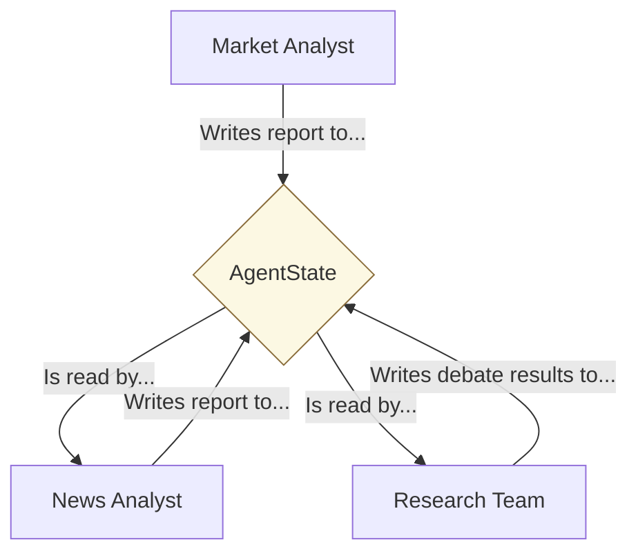
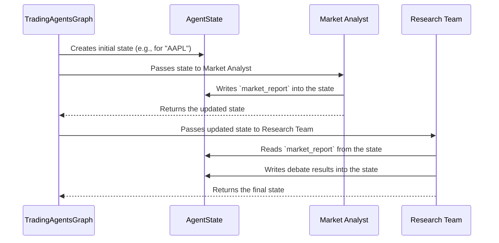

# Chapter 4: AgentState

In the [previous chapter](03_agents__the_specialists_.md), we met our team of specialists: the `Market Analyst`, the `News Analyst`, and others. Each agent has a specific job to do. But once the `Market Analyst` finishes its chart analysis, how does the `Research Team` get that information? How do they know what the `Market Analyst` found?

They can't just shout across the office. They need a central place to share their work. This is the problem that `AgentState` solves.

## What is AgentState? The Shared Whiteboard

Imagine our team of agents is working together in a room with a giant whiteboard.

*   When the `Market Analyst` finishes analyzing the stock chart, it walks up to the whiteboard and writes down its report under the "Market Analysis" section.
*   Next, the `News Analyst` reads the market report for context, does its own research, and then adds its findings to the "News Analysis" section.
*   Later, the `Research Team` can read everything on the whiteboard to have a structured debate.

The `AgentState` is this shared whiteboard. It's a central object that holds all the information for a single analysis run. As each agent completes its task, it writes its findings to the `AgentState`. The next agent then reads from the `AgentState` to get the context it needs.

This ensures all information is stored in one place, creating a **single source of truth** for the entire workflow.



## The Structure of the Whiteboard

So, what does this "whiteboard" look like? In our code, `AgentState` is a special kind of Python dictionary called a `TypedDict`. This just means it's a dictionary with predefined keys, so we always know what sections are available on our whiteboard.

Let's look at a simplified version of its structure.

```python
# From: tradingagents/agents/utils/agent_states.py

class AgentState(MessagesState):
    # Initial Information
    company_of_interest: str
    trade_date: str

    # Analyst Reports (where agents write their findings)
    market_report: str
    sentiment_report: str
    news_report: str
    
    # Team-Specific States (like mini-whiteboards)
    investment_debate_state: InvestDebateState
    
    # Final Outputs
    final_trade_decision: str
```

This code defines the "sections" of our whiteboard:

1.  **Initial Information:** `company_of_interest` and `trade_date` are filled in at the very beginning. This tells every agent what stock and date they are analyzing.
2.  **Analyst Reports:** Fields like `market_report` and `news_report` start out empty. Each analyst agent is responsible for filling in its corresponding section.
3.  **Team-Specific States:** Sometimes a team needs its own small whiteboard for a private discussion. `investment_debate_state` is a nested dictionary that the Research Team uses to conduct its debate without cluttering the main board.
4.  **Final Outputs:** At the end of the entire process, the final decision is written to a field like `final_trade_decision`.

## How Information Flows Through the AgentState

The [TradingAgentsGraph](02_tradingagentsgraph_.md) is responsible for passing this whiteboard from one agent to the next.

Here’s the step-by-step flow:



1.  **Initialization:** The process starts. The graph creates a new, mostly empty `AgentState` object, only filling in the company ticker and date.
2.  **Pass to First Agent:** The graph hands this `AgentState` to the first agent in line, the `Market Analyst`.
3.  **Agent Writes:** The `Market Analyst` performs its analysis and writes its findings into the `market_report` field of the `AgentState` it received.
4.  **Pass to Next Agent:** The graph takes the *updated* `AgentState` (which now contains the market report) and passes it to the next agent, the `Research Team`.
5.  **Agent Reads and Writes:** The `Research Team` can now read the `market_report` to understand the technicals. After its own debate, it writes its conclusions into the `investment_debate_state` field.

This cycle continues until the last agent has contributed, and the `AgentState` contains the complete analysis.

## Under the Hood: Code in Action

Let's see how this is implemented.

#### 1. Defining the State

The `AgentState` is defined using Python's `TypedDict`. We use `Annotated` to add a helpful description to each field, which acts like a label on our whiteboard section.

```python
# From: tradingagents/agents/utils/agent_states.py

class AgentState(MessagesState):
    # ...
    market_report: Annotated[str, "Report from the Market Analyst"]
    sentiment_report: Annotated[str, "Report from the Social Media Analyst"]
    # ...
```

This is the blueprint for our shared state. `MessagesState` is a special base class from LangGraph that automatically gives us a `messages` field to track the conversation history.

#### 2. Creating the Initial State

When you start an analysis, the `Propagator` class creates the initial, "blank slate" version of the `AgentState`.

```python
# From: tradingagents/graph/propagation.py

def create_initial_state(self, company_name: str, trade_date: str):
    return {
        "company_of_interest": company_name,
        "trade_date": str(trade_date),
        # All other report fields are empty by default
        "market_report": "",
        "sentiment_report": "",
        # ... and so on
    }
```
This function returns a simple dictionary that matches the `AgentState` structure, filling in only the essential starting information.

#### 3. How an Agent Updates the State

When an agent function (which is a **node** in our graph) finishes its work, it doesn't modify the state directly. Instead, it returns a dictionary containing only the fields it wants to update. The `TradingAgentsGraph` automatically merges this new information into the main `AgentState`.

Here's a simplified view of what the `market_analyst_node` returns:

```python
# Simplified from an agent function

def market_analyst_node(state):
    # 1. The agent does its analysis using the `state`...
    report = "The stock is showing a bullish trend..."

    # 2. It returns a dictionary with the field to update.
    return {
        "market_report": report
    }
```
When the graph receives this dictionary, it finds the `market_report` key in the main `AgentState` and updates its value with the new report. It's clean, simple, and prevents agents from accidentally overwriting each other's work.

## Conclusion

The `AgentState` is the central nervous system of our framework. It's the shared whiteboard that enables our specialized [Agents (The Specialists)](03_agents__the_specialists_.md) to communicate and collaborate effectively.

By passing a single, evolving state object through the [TradingAgentsGraph](02_tradingagentsgraph_.md), we ensure that:
*   Every agent has access to the full context of the analysis so far.
*   Information flows seamlessly from one step to the next.
*   We maintain a "single source of truth" for the entire operation.

Now we understand how agents get their instructions and how they share their findings. But how do they gather information from the outside world, like fetching stock prices or searching the web? For that, they need special abilities.

Next up: [Toolkit & Tools](05_toolkit___tools_.md)

---

Generated by [AI Codebase Knowledge Builder](https://github.com/The-Pocket/Tutorial-Codebase-Knowledge)