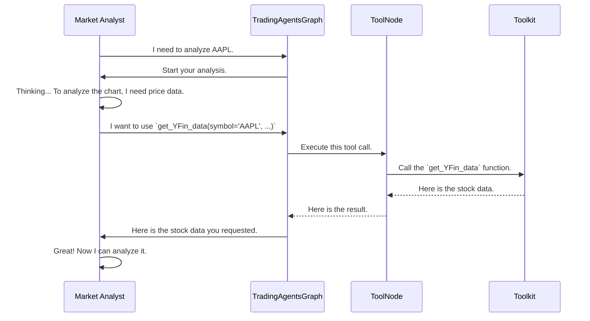

# Chapter 5: Toolkit & Tools

In the [previous chapter](04_agentstate_.md), we learned about the `AgentState`, the shared whiteboard where our agents read and write their findings. We know how the `Market Analyst` can write its report for others to see.

But where does the `Market Analyst` get its data in the first place? It can't just invent stock prices. It needs a way to connect to the outside world.

That's where the **Toolkit & Tools** come in.

## What is a Toolkit? The Agent's Computer

Imagine a human financial analyst at their desk. They have a computer with access to powerful software: a Bloomberg Terminal for market data, a web browser for news, and financial modeling software. These are the tools of their trade.

Our AI agents need their own set of digital tools. The `Toolkit` is exactly that: it's the toolbox we give to each [Agent (The Specialist)](03_agents__the_specialists_.md). Inside this toolbox are individual **Tools**—special functions that let the agent perform specific actions, like:
*   Fetching historical stock prices.
*   Searching for recent news articles.
*   Getting a company's financial statements.

This design cleanly separates the agent's "brain" (its reasoning logic) from its "hands" (the low-level details of how to get data). The agent only needs to know *what* it wants to do, not *how* to do it.

```mermaid
graph TD
    A[Agent's Brain (LLM)] -- "I need AAPL's price!" --> B{Toolkit};
    B --> C[Tool: get_YFin_data];
    B --> D[Tool: get_google_news];
    B --> E[Tool: get_fundamentals_openai];

    style A fill:#d1ecf1,stroke:#0c5460
    style B fill:#e2e3e5,stroke:#383d41
```

## Anatomy of a Tool

A "Tool" is just a regular Python function with a special superpower. Let's look at one of the most important tools in our project, `get_YFin_data`.

**The Goal:** The `Market Analyst` needs to get the stock price data for Apple from January 1st to January 31st, 2024.

**The Tool:** It uses the `get_YFin_data` tool. Here's a simplified look at how that tool is defined.

```python
# From: tradingagents/agents/utils/agent_utils.py

# The `@tool` decorator turns this function into a Tool
@tool
def get_YFin_data(
    symbol: Annotated[str, "ticker symbol of the company"],
    start_date: Annotated[str, "Start date in yyyy-mm-dd"],
    end_date: Annotated[str, "End date in yyyy-mm-dd"],
) -> str:
    """Retrieve stock price data from Yahoo Finance."""
    # ... code to connect to Yahoo Finance and get data ...
    return formatted_data_string
```

Let's break this down:
1.  **`@tool`:** This is a special decorator from LangChain. It tells our system, "This isn't just a function; it's a tool that an AI agent can choose to use."
2.  **Function Name (`get_YFin_data`):** This is the name the agent will use to call the tool.
3.  **Docstring (`"""..."""`):** The description is crucial! The LLM reads this to understand what the tool does.
4.  **`Annotated[...]`:** This is the most magical part. The descriptions here ("ticker symbol of the company") tell the LLM exactly what kind of information to provide for each argument.

Because of these clear descriptions, the agent's LLM knows that to get Apple's stock price, it needs to call `get_YFin_data` with `symbol='AAPL'`.

## The `Toolkit`: The Master Toolbox

While a single tool is useful, we have dozens of them. The `Toolkit` is a simple class that groups all these related functions into one convenient object. It's the toolbox that holds all our screwdrivers, hammers, and wrenches.

```python
# From: tradingagents/agents/utils/agent_utils.py

class Toolkit:
    # ... configuration stuff ...

    @staticmethod
    @tool
    def get_YFin_data(...) -> str:
        """Retrieve the stock price data..."""
        # ... implementation ...

    @staticmethod
    @tool
    def get_google_news(...) -> str:
        """Retrieve the latest news from Google News..."""
        # ... implementation ...

    # ... and many more tools! ...
```
By organizing all tools inside this `Toolkit` class, we can easily create an instance and pass it to any agent that needs it.

## How an Agent Uses a Tool

Here's the key idea: **the agent doesn't call the Python function directly.** Instead, the LLM inside the agent *decides* which tool to use. The [TradingAgentsGraph](02_tradingagentsgraph_.md) then takes care of actually running the function.

Here's a step-by-step look at how the `Market Analyst` gets its data.



## Under the Hood: Wiring it all Together

How does the system know which tools are available and how to run them? This happens in a few key places.

#### 1. Giving an Agent its Tools

First, when we create an agent, we give it a list of the specific tools it's allowed to use from the `Toolkit`. The `News Analyst`, for example, gets news-related tools.

```python
# From: tradingagents/agents/analysts/news_analyst.py

def create_news_analyst(llm, toolkit):
    def news_analyst_node(state):
        # Select the tools this specific agent can use
        tools = [
            toolkit.get_finnhub_news,
            toolkit.get_reddit_news,
            toolkit.get_google_news,
        ]
        
        # ... create prompt and bind tools to the LLM ...
        chain = prompt | llm.bind_tools(tools)
        # ...
```
This `llm.bind_tools(tools)` call is what makes the LLM aware of the tools and their descriptions.

#### 2. The `ToolNode`: The Executor

The [TradingAgentsGraph](02_tradingagentsgraph_.md) has special nodes called `ToolNode`s. A `ToolNode` is a step in the graph whose only job is to execute tool calls.

In our main graph setup, we create different `ToolNode`s for different categories of tools.

```python
# From: tradingagents/graph/trading_graph.py

class TradingAgentsGraph:
    def _create_tool_nodes(self) -> Dict[str, ToolNode]:
        """Create tool nodes for different data sources."""
        return {
            "market": ToolNode([
                self.toolkit.get_YFin_data,
                # ... other market tools ...
            ]),
            "news": ToolNode([
                self.toolkit.get_google_news,
                # ... other news tools ...
            ]),
        }
```
This code creates a "market" tool station and a "news" tool station in our analysis assembly line.

#### 3. Routing to the ToolNode

Finally, the graph needs to know *when* to use the `ToolNode`. This is handled by a [conditional edge](02_tradingagentsgraph_.md#3-conditional-edges-the-smart-router) that checks if the agent's last message was a request to use a tool.

If the agent says, "I want to call `get_YFin_data`", the graph routes the flow to the `ToolNode`. The `ToolNode` runs the function and passes the results back to the agent so it can continue its work.

## Conclusion

The `Toolkit` and `Tools` are the bridge between our AI agents and the real world. They provide a clean, powerful, and extensible way for agents to gather the information they need to do their jobs.

*   A **Tool** is a single, well-described function that gives an agent a specific capability (e.g., fetching news).
*   The **`Toolkit`** is a container that organizes all available tools.
*   Agents don't execute tools directly; they **request** to use them, and the `TradingAgentsGraph` handles the execution.

This abstraction is what turns our agents from isolated thinkers into resourceful analysts capable of interacting with live data streams.

Now you know *what* tools the agents have. But how do those tools *actually* get the data from places like Yahoo Finance or Reddit? What happens inside those tool functions? For that, we need to look at the next layer of our system.

Next up: [Dataflows](06_dataflows_.md)

---

Generated by [AI Codebase Knowledge Builder](https://github.com/The-Pocket/Tutorial-Codebase-Knowledge)