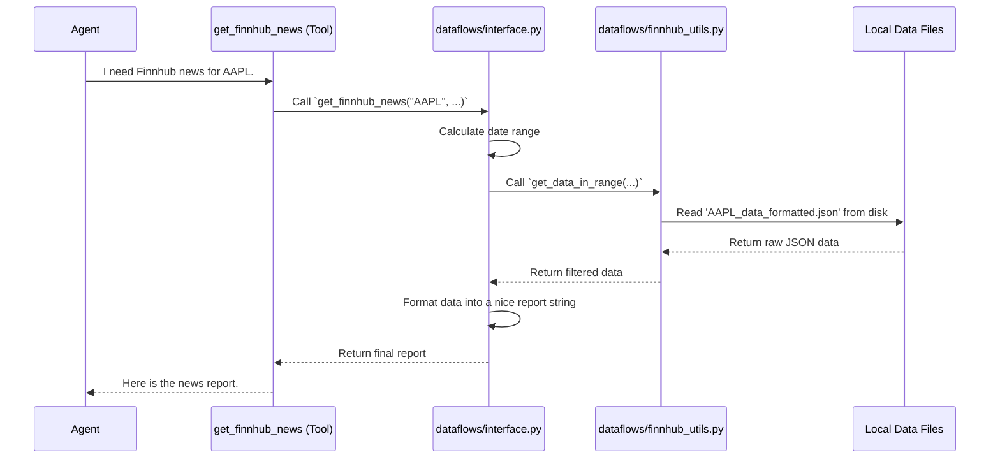

# Chapter 6: Dataflows

In the [previous chapter](05_toolkit___tools_.md), we equipped our agents with a `Toolkit` full of powerful `Tools`. We saw how the `Market Analyst` can decide to use a tool like `get_YFin_data` to get stock prices.

But when a tool is called, what happens next? How does the code *actually* connect to Yahoo Finance, Reddit, or Finnhub to retrieve the data? Who handles the messy details of API requests, data cleaning, and formatting?

Welcome to the engine room of our application: the **Dataflows** layer.

## What are Dataflows? The Kitchen of Our Restaurant

Imagine our `TradingAgents` framework is a high-tech restaurant.
*   The [Agents (The Specialists)](03_agents__the_specialists_.md) are the customers, deciding what they want to order.
*   The [Toolkit & Tools](05_toolkit___tools_.md) are the menu items they can choose from, like "Get Today's News" or "Fetch Stock Price."

When an agent "orders" a tool, the request doesn't magically produce data. The order goes to the kitchen. The **Dataflows** layer is this kitchen. It's a collection of specialist "chefs" (utility functions) who know exactly how to get the ingredients (data) from different suppliers (APIs) and prepare them perfectly.

The customer (the agent) doesn't need to know if the news came from a web scraper or a direct API call. They just order from the menu and get a perfectly prepared dish. Dataflows handles all the behind-the-scenes work, keeping the rest of our application clean and simple.

```mermaid
graph TD
    A[Agent] -- "I need news!" --> B[Toolkit's `get_news` Tool];
    B -- "Get news for AAPL" --> C{Dataflows Interface};
    subgraph "The Kitchen (Dataflows Layer)"
        direction LR
        C -- "Routes request to..." --> D[Finnhub Chef<br>(finnhub_utils.py)];
        C -- "Or maybe..." --> E[Reddit Chef<br>(reddit_utils.py)];
        D --> F[Connects to Finnhub API];
        E --> G[Scrapes Reddit Data];
    end

    style C fill:#fcf8e3,stroke:#8a6d3b
```

## The Three Key Parts of Dataflows

Our "kitchen" is organized into three main areas, which correspond to files in the `tradingagents/dataflows/` directory.

1.  **Specialist Utils (e.g., `yfin_utils.py`, `finnhub_utils.py`):** These are the individual "chef stations." Each `_utils.py` file contains the specific, low-level logic for talking to just *one* data source. The `finnhub_utils.py` file only knows how to talk to Finnhub; it knows nothing about Reddit.

2.  **The Interface (`interface.py`):** This is the head chef or restaurant manager. It provides a single, clean set of functions that the [Toolkit & Tools](05_toolkit___tools_.md) can call. The interface hides all the complexity of the specialist utils. When a tool needs data, it *only* talks to `interface.py`.

3.  **The `__init__.py` file:** This is like the restaurant's front door. It makes all the clean functions from `interface.py` easily available to the rest of the application, so we can import them with a simple one-line command.

## How it Works: From Tool to Data

Let's follow a request for news from our `News Analyst` to see how these parts work together.

**Goal:** The agent wants the latest news about a company from the Finnhub service.


The agent only interacts with the tool. The tool only interacts with the clean `interface.py`. The interface handles the logic and calls the specialized `finnhub_utils.py`, which does the "dirty work" of reading a file. This separation of concerns is what makes the system so maintainable.

## A Look Under the Hood at the Code

Let's see the code for each step of this process, simplified for clarity.

#### Step 1: The Clean Interface (`interface.py`)

The tool calls this beautiful, clean function. Its job is to prepare the request and then format the response.

```python
# From: tradingagents/dataflows/interface.py

def get_finnhub_news(ticker, curr_date, look_back_days):
    """Retrieve news about a company within a time frame."""
    
    # 1. Do some simple prep work, like calculating dates.
    start_date = calculate_start_date(curr_date, look_back_days)

    # 2. Call the low-level utility function to get the raw data.
    result = get_data_in_range(ticker, start_date, curr_date, "news_data", ...)

    # 3. Format the raw data into a clean, human-readable report.
    report = format_news_results(result)
    
    return report
```
Notice how this function is easy to read. It doesn't contain any messy API logic. It delegates the hard part to `get_data_in_range`.

#### Step 2: The Specialist Utility (`finnhub_utils.py`)

This is where the actual data retrieval happens. In this case, our system is designed to use pre-downloaded data saved in JSON files to be efficient. The agent doesn't know or care about this detail.

```python
# From: tradingagents/dataflows/finnhub_utils.py

def get_data_in_range(ticker, start_date, end_date, data_type, ...):
    """Gets finnhub data saved and processed on disk."""
    
    # 1. Figure out the correct file path.
    data_path = f"data/finnhub_data/{data_type}/{ticker}_data_formatted.json"

    # 2. Open the file and load the JSON data.
    with open(data_path, "r") as f:
        data = json.load(f)

    # 3. Filter the data to match the requested date range.
    filtered_data = {k: v for k, v in data.items() if start_date <= k <= end_date}
    
    return filtered_data
```
This function's only job is to deal with files and JSON. It's the specialist "chef" who knows exactly where the Finnhub "ingredients" are stored and how to get them.

#### Step 3: Making it All Accessible (`__init__.py`)

Finally, how does the `Toolkit` easily import `get_finnhub_news`? A special file named `__init__.py` in the `dataflows` folder acts as an index, exporting all the clean functions from the interface.

```python
# From: tradingagents/dataflows/__init__.py

from .interface import (
    # News and sentiment functions
    get_finnhub_news,
    get_google_news,
    get_reddit_company_news,

    # Market data functions
    get_YFin_data,
    # ... and many more
)
```
Because of this file, another part of our program can simply write `from tradingagents.dataflows import get_finnhub_news` without needing to know that the function actually lives inside `interface.py`. It provides a clean public "facade" to the entire module.

## Conclusion

The **Dataflows** layer is the critical, behind-the-scenes engine that powers our agents' tools. It acts as a robust data-access layer that connects our application to the outside world of financial data.

By organizing our code this way, we achieve a powerful separation of concerns:
*   **Agents** focus on high-level reasoning.
*   **Tools** provide a menu of capabilities.
*   **The Dataflows Interface** offers a single, clean entry point for data requests.
*   **Dataflows Utils** handle the messy, source-specific details of fetching data.

This design makes our system incredibly flexible. If we want to add a new data source, like Bloomberg, we just need to add a new `bloomberg_utils.py` file and a new function in `interface.py`. The rest of our application, including the agents and tools, doesn't need to change at all.

So far, we've seen how agents work, how they use tools, and how those tools get data. But what happens when an analysis is over? How do our agents learn from their past successes and failures?

Next up: [Memory & Reflection](07_memory___reflection_.md)

---

Generated by [AI Codebase Knowledge Builder](https://github.com/The-Pocket/Tutorial-Codebase-Knowledge)