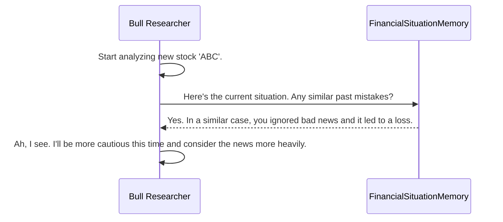

# Chapter 7: Memory & Reflection

In the [previous chapter](06_dataflows_.md), we explored the `Dataflows` layer, the "kitchen" that prepares all the raw data our agents need. We have now seen the entire pipeline of a single analysis, from the initial command in the [CLI Dashboard](01_cli_dashboard_.md) to the final trading decision.

But what happens next? What's the difference between a system that just follows rules and one that actually learns? The answer is the ability to look back, understand mistakes, and improve. This is where **Memory & Reflection** come in.

## What is Memory & Reflection? The Learning Loop

Imagine a junior trader makes their first big trade. It goes poorly, and they lose money. A good senior trader wouldn't just say, "You were wrong." They would sit down with the junior trader and ask:
*   "What was the situation?"
*   "What information did you have?"
*   "Why did you make that decision?"
*   "Now that we know the outcome, what was the flaw in your reasoning?"
*   "What's the lesson we can learn here so we don't repeat this mistake?"

This process of review and learning is what turns experience into expertise. **Memory & Reflection** is the mechanism that gives our agent team this exact ability. It creates a learning loop for our system.

1.  **Act:** The agent team performs an analysis and makes a decision.
2.  **Observe:** The outcome of that decision (profit or loss) is recorded.
3.  **Reflect:** A special agent, the `Reflector`, analyzes what went right or wrong.
4.  **Remember:** The lesson learned is stored in a long-term memory.
5.  **Improve:** In future analyses, agents consult this memory to avoid past mistakes.

This chapter explores this powerful learning loop.

## The Key Components

Our learning system has two main parts: the "teacher" and the "notebook."

#### 1. The `Reflector`: The Teacher

The `Reflector` is a special agent that is activated *after* a trade's outcome is known. Its job is to be the wise, experienced mentor. It reviews the entire analysis—all the reports, the debate, and the final decision—and compares it with the actual result. It then generates a concise "lesson learned."

#### 2. The `FinancialSituationMemory`: The Notebook

The `FinancialSituationMemory` is the system's long-term memory. It's where the lessons generated by the `Reflector` are stored. But it's more than just a simple log file. It's a special kind of database called a **vector database**, which has a superpower: it can find memories based on *conceptual similarity*, not just keywords.

You can ask it, "Show me lessons from situations that *feel like* this one," and it will find the most relevant past experiences, even if the stock tickers or dates are completely different.

## How the Learning Loop Works

Let's walk through an example.

**Step 1: The Analysis**
The agent team analyzes stock `XYZ` and, after much debate, recommends a **BUY**.

**Step 2: The Outcome**
A week later, we see that the trade resulted in a **-5% loss**. This was a bad decision.

**Step 3: Reflection is Triggered**
We now trigger the reflection process. This happens inside the main `TradingAgentsGraph` class.

```python
# From: tradingagents/graph/trading_graph.py

def reflect_and_remember(self, returns_losses):
    """Reflect on decisions and update memory based on returns."""
    # Reflect on the Bull Researcher's arguments
    self.reflector.reflect_bull_researcher(
        self.curr_state, returns_losses, self.bull_memory
    )
    # ... reflect on other agents like the Bear, Trader, etc. ...
```
This function takes the final `AgentState` of the analysis (`self.curr_state`) and the outcome (`returns_losses`). It then calls the `Reflector` to analyze the performance of each key agent.

**Step 4: The `Reflector` Generates a Lesson**
The `Reflector` gets to work. It's given a specific prompt that tells it how to think like a coach.

```python
# From: tradingagents/graph/reflection.py

# A simplified version of the Reflector's prompt
reflection_prompt = """
You are an expert financial analyst reviewing a trading decision.
Your goal is to find the lesson learned.

1. Was the decision correct or incorrect given the outcome?
2. What were the key factors that led to the success or mistake?
3. How can we improve next time?
4. Summarize the key lesson in a single, concise sentence.
"""
```
The `Reflector` looks at the `market_report`, the `news_report`, the `bull_history` from the debate, and the `-5%` return. It might conclude:

> *"The Bull analyst was overly focused on a positive technical indicator (the RSI) and ignored clear negative sentiment in the news report. Lesson: In volatile markets, news sentiment should be given more weight than single technical signals."*

**Step 5: The Lesson is Stored**
This lesson, along with a summary of the situation that produced it, is then saved into the `FinancialSituationMemory`.

```python
# From: tradingagents/graph/reflection.py

def reflect_bull_researcher(self, current_state, returns_losses, bull_memory):
    """Reflect on bull researcher's analysis and update memory."""
    # 1. Get a summary of the market situation
    situation = self._extract_current_situation(current_state)
    bull_debate_history = current_state["investment_debate_state"]["bull_history"]

    # 2. Use the LLM to generate the lesson (the 'result')
    result = self._reflect_on_component(
        "BULL", bull_debate_history, situation, returns_losses
    )
    
    # 3. Save the situation and the lesson to memory
    bull_memory.add_situations([(situation, result)])
```
The `bull_memory.add_situations` call is what saves the lesson for the future.

## Closing the Loop: Using Memory in Future Decisions

Storing lessons is useless if we never read them. The final, most important step is how our agents use this memory to make better decisions next time.

Months later, the team is analyzing a new stock, `ABC`. The situation is eerily similar: the market is volatile, the technicals look okay, but the news sentiment is negative.

When the `Bull Researcher` starts its analysis, its first step is to check its memory.



This is reflected directly in the agent's code. Before forming its argument, it queries the memory.

```python
# From: tradingagents/agents/researchers/bull_researcher.py

def create_bull_researcher(llm, memory):
    def bull_node(state) -> dict:
        # ... gets current market reports ...
        curr_situation = f"{market_research_report}\n..."
        
        # 1. Query memory for lessons from similar past situations
        past_memories = memory.get_memories(curr_situation, n_matches=2)
        
        # ... formats memories into a string ...

        # 2. Add the lessons to the prompt for context
        prompt = f"""You are a Bull Analyst...
Reflections from similar situations and lessons learned: {past_memory_str}
Use this information to deliver a compelling bull argument...
"""
        # ... invoke LLM and return result ...
```
By adding `Reflections from similar situations` directly into its instructions, the agent is forced to consider its past mistakes. It learns from experience, closes the learning loop, and makes a smarter, more nuanced decision.

## Under the Hood: The `FinancialSituationMemory`

How does the memory find "similar" situations? It uses a technique called **embeddings**.

1.  **Storing (`add_situations`):** When a new lesson is saved, the `FinancialSituationMemory` uses an LLM to convert the text describing the *situation* (the market reports, etc.) into a list of numbers (a "vector" or "embedding"). This vector captures the semantic meaning of the text. The situation-vector and its corresponding lesson are then stored.

    ```python
    # From: tradingagents/agents/utils/memory.py
    
    def add_situations(self, situations_and_advice):
        """Add situations and their corresponding advice."""
        for i, (situation, recommendation) in enumerate(situations_and_advice):
            # 1. Convert the situation text into a numerical vector
            embedding = self.get_embedding(situation)
            # 2. Store the vector and the lesson (recommendation)
            self.situation_collection.add(...)
    ```

2.  **Recalling (`get_memories`):** When an agent wants to recall a memory, it provides its *current* situation. The memory converts this new text into a vector as well. It then performs a mathematical search to find the stored vectors that are numerically closest to the new one. These are the most "similar" past situations.

    ```python
    # From: tradingagents/agents/utils/memory.py

    def get_memories(self, current_situation, n_matches=1):
        """Find matching recommendations using embeddings."""
        # 1. Convert the current situation into a numerical vector
        query_embedding = self.get_embedding(current_situation)

        # 2. Find the stored vectors that are most similar
        results = self.situation_collection.query(
            query_embeddings=[query_embedding], n_results=n_matches
        )
        return results # ... returns the lessons from those matches
    ```

This powerful technique allows the system to generalize its learning across different stocks, dates, and market conditions.

## Conclusion

**Memory & Reflection** transforms `TradingAgents` from a static analysis tool into a dynamic system that learns and evolves. It establishes a critical feedback loop where the system:
*   Analyzes its own performance after the fact.
*   Distills successes and failures into actionable lessons.
*   Stores these lessons in a conceptually-searchable long-term memory.
*   Consults this memory to inform future decisions, preventing repeated mistakes.

This concludes our high-level tour of the core components of the `TradingAgents` framework. You've seen the user interface, the workflow engine, the specialist agents, their shared state, their tools, their data sources, and finally, their ability to learn. You now have a complete picture of how this sophisticated multi-agent system works together to tackle complex financial analysis.

---

Generated by [AI Codebase Knowledge Builder](https://github.com/The-Pocket/Tutorial-Codebase-Knowledge)