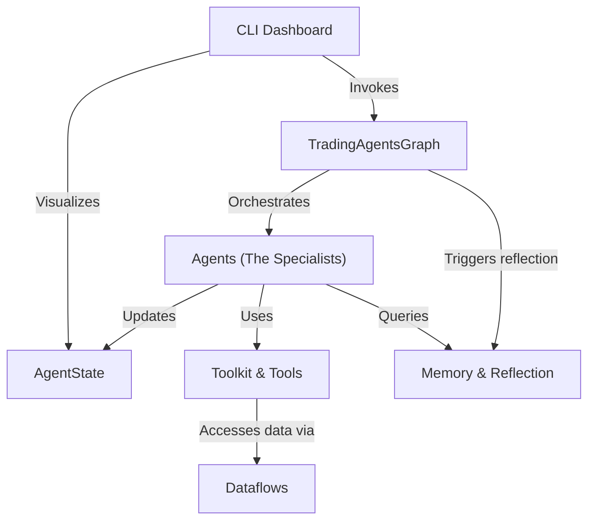

# Tutorial: TradingAgents

`TradingAgents` is a framework that uses a team of specialized **AI agents** to perform a deep financial analysis on a stock. It orchestrates these agents in a step-by-step *workflow*, where each agent, like a *Market Analyst* or *News Analyst*, contributes its findings. The agents use a set of **tools** to fetch real-world data and communicate by updating a shared **state**. A user can monitor this entire process in real-time through an interactive **CLI dashboard**. The system is designed to improve over time by *reflecting* on its past decisions and storing lessons in a long-term **memory**.

**Source Repository:** [https://github.com/gordony2028/TradingAgents](https://github.com/gordony2028/TradingAgents)

## Chapters

1. [CLI Dashboard
](01_cli_dashboard_.md)
2. [TradingAgentsGraph
](02_tradingagentsgraph_.md)
3. [Agents (The Specialists)
](03_agents__the_specialists__.md)
4. [AgentState
](04_agentstate_.md)
5. [Toolkit & Tools
](05_toolkit___tools_.md)
6. [Dataflows
](06_dataflows_.md)
7. [Memory & Reflection
](07_memory___reflection_.md)

---

Generated by [AI Codebase Knowledge Builder](https://github.com/The-Pocket/Tutorial-Codebase-Knowledge)